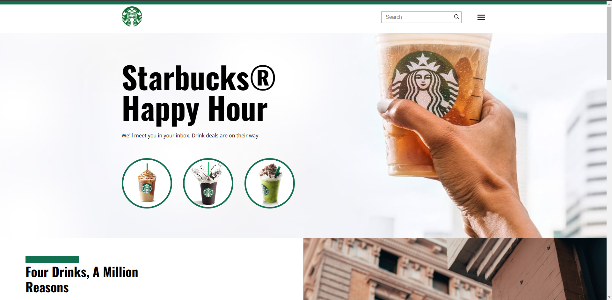
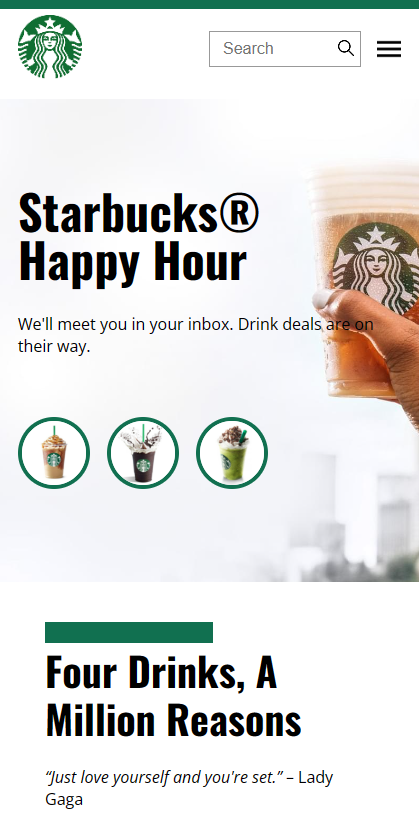

# projeto-starbucks

### Projeto simples de HTML e CSS.

## Demonstração do projeto
- <a href="https://starbucks-victor.vercel.app/">Link</a>

## Tecnologias Utilizadas
 - HTML
 - CSS
 
## Conhecimentos reforçados
 - Posicionamento
 - Grid
 - Flexbox
 - Padrões de acessibilidade
 - Responsibilidade

## Layout
 - Feito com base no layout feito pela <a href="https://nicepage.com/website-builder-software/preview/starbucks-coffee-17223">Nicepage</a>

## Projeto Desktop

## Projeto Mobile

